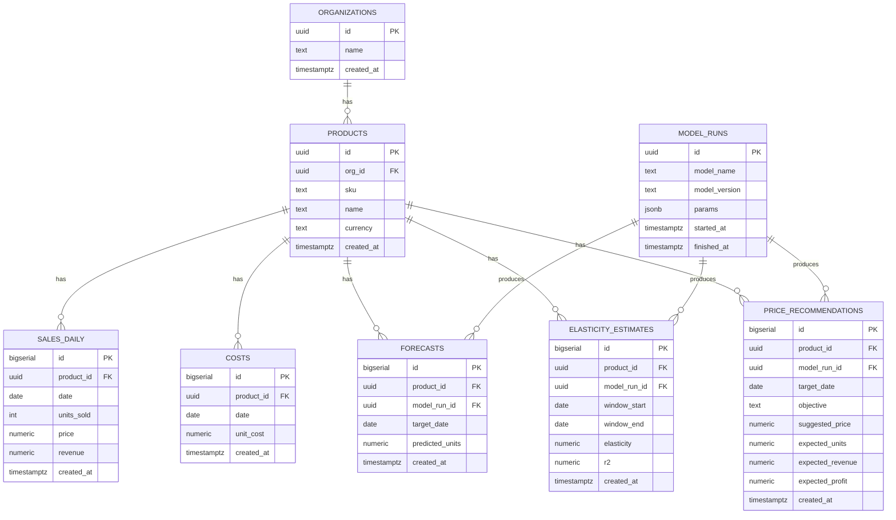
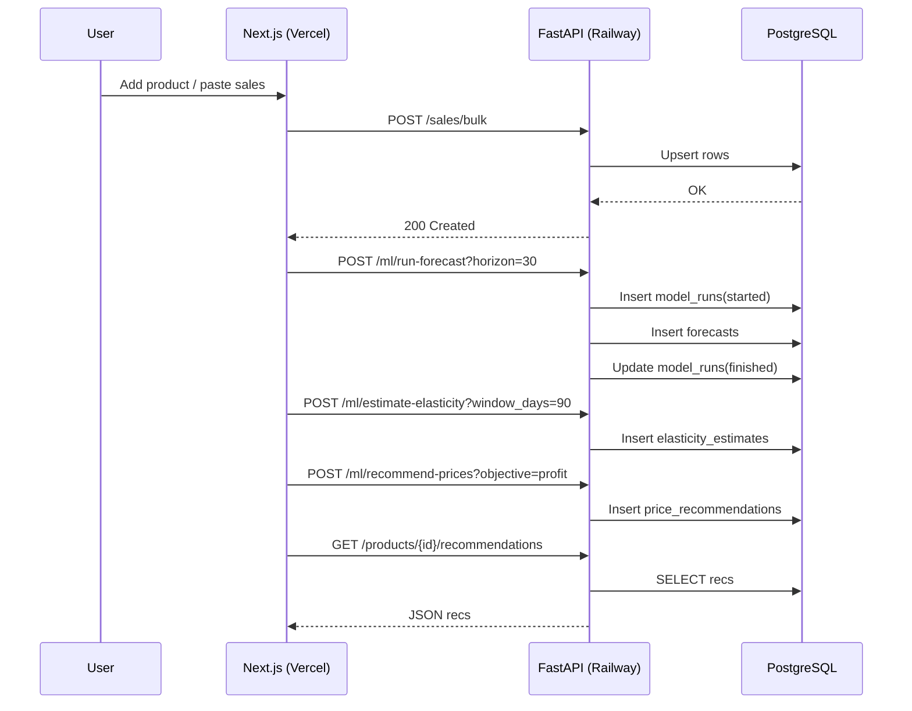

# /ARCHITECTURE.md

## High‑Level Components

* **Frontend (Vercel)**: Next.js + TS UI, React Query, Recharts, file‑free data entry
* **Backend (Railway)**: FastAPI REST, async SQLAlchemy, services for forecasting/elasticity/pricing
* **DB (Railway Postgres)**: normalized schema, indices for time‑series queries
* **Jobs**: On‑demand endpoints (v1). Optional scheduler (Railway cron) for nightly runs

### Component Diagram

```mermaid
flowchart LR
  subgraph Client
    U[Browser]
  end

  subgraph Vercel[Frontend — Next.js (TS)]
    FE[UI: Upload/Charts/Controls]
  end

  subgraph Railway[Backend — FastAPI]
    API[REST Endpoints]
    Svc[Services: Forecasting/Elasticity/Pricing]
    Jobs[Background Job Runner]
  end

  subgraph DB[(PostgreSQL)]
    T[(Tables: orgs, products, sales_daily, costs, forecasts, runs, elasticity, recs)]
  end

  U --> FE
  FE <---> API
  API --> DB
  Svc --> DB
  Jobs --> DB
```

### ERD (Database Schema)



### Sequence: Ingest → Recommend



---

## API Surface (v1)

| Method | Path                             | Description                                                                   |
| ------ | -------------------------------- | ----------------------------------------------------------------------------- |
| GET    | `/health`                        | Health check                                                                  |
| POST   | `/orgs`                          | Create organization                                                           |
| POST   | `/products`                      | Create product                                                                |
| POST   | `/sales/bulk`                    | Bulk upsert sales rows                                                        |
| POST   | `/ml/run-forecast`               | Train/predict demand; params: `product_id?`, `horizon`                        |
| POST   | `/ml/estimate-elasticity`        | Estimate elasticity over window                                               |
| POST   | `/ml/recommend-prices`           | Compute price suggestions; params: `objective`, `pmin`, `pmax`, `product_id?` |
| GET    | `/products/{id}/forecasts`       | List forecasts by date range                                                  |
| GET    | `/products/{id}/recommendations` | List price recommendations                                                    |

**Schemas:** JSON bodies follow Pydantic models; all dates ISO‑8601.

---

## Tech Choices

* **Python**: FastAPI, SQLAlchemy (async), Alembic, pandas, scikit‑learn, lightgbm
* **TypeScript**: Next.js, React Query, Recharts/TanStack Table, Tailwind CSS
* **DB**: PostgreSQL with sensible indices
* **Hosting**: Railway (API + DB), Vercel (UI)

---

## Risks & Mitigations

* **Sparse price variation → weak elasticity** → show R²/confidence, fallback to conservative pricing
* **Cold starts on Railway/Vercel** → keep ML in background jobs; cache results in DB
* **Schema drift** → enforce migrations; write DB tests

---

## Roadmap (8 weeks)

1. DB + Minimal API (week 1)
2. Elasticity + Pricing (week 2)
3. Forecasting (week 3)
4. Frontend MVP (week 4)
5. Deploy (week 5)
6. Testing/seed data (week 6)
7. Polish UX & docs (week 7)
8. Case study + demo video (week 8)

---

## Glossary

* **Elasticity**: % change in demand per % change in price
* **MAPE**: Mean Absolute Percentage Error (forecast metric)
* **Horizon**: number of future days to forecast
